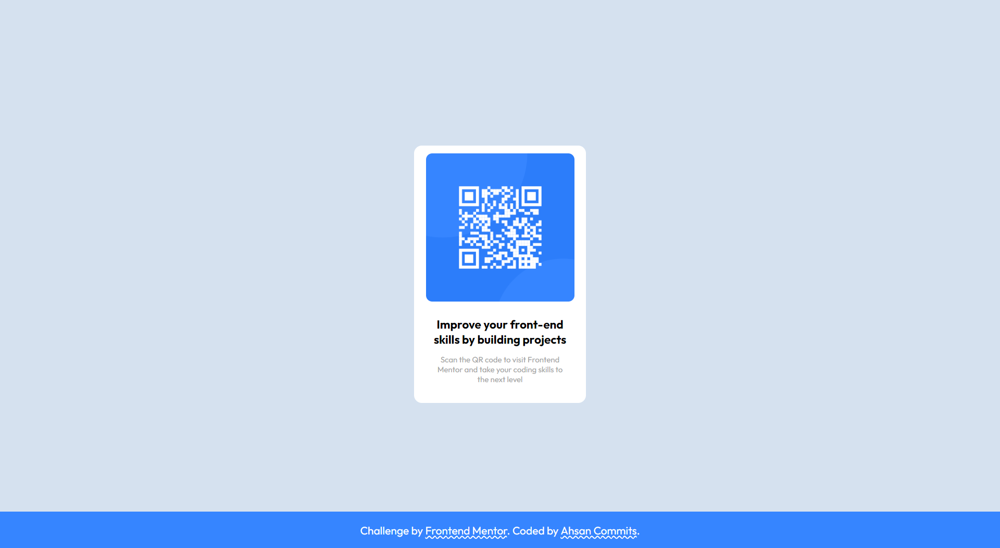

# Frontend Mentor - QR code component solution

This is a solution to the [QR code component challenge on Frontend Mentor](https://www.frontendmentor.io/challenges/qr-code-component-iux_sIO_H). Frontend Mentor challenges help you improve your coding skills by building realistic projects.

## Table of contents

- [Overview](#overview)
  - [Screenshot](#screenshot)
  - [Links](#links)
- [My process](#my-process)
  - [Built with](#built-with)
  - [What I learned](#what-i-learned)
  - [Continued development](#continued-development)
- [Author](#author)
- [Acknowledgments](#acknowledgments)

## Overview

### Screenshot

### Links

- Solution URL: [Add solution URL here](https://your-solution-url.com)
- Live Site URL: [Add live site URL here](https://your-live-site-url.com)

## My process

### Built with

- Semantic HTML5 markup
- CSS custom properties
- Flexbox

### What I learned

During the process of working on this project, I gained several key learnings:

1. Semantic HTML Markup: I reinforced the importance of using semantic HTML tags to improve accessibility and maintainable code structure. For example, I utilized `<main>`, `<footer>`, and other semantic tags appropriately in this project.

2. CSS Flexbox: The `display: flex` property along with the `justify-content` and `align-items` properties helped me create the centered and responsive design in this project.

### Continued development

In future projects, I want to focus on:

1. Responsive Design
2. JavaScript Frameworks
3. Performance Optimization
4. Accessibility
5. Testing and Debugging

## Author

- Website - [Ahsan Raza](https://ahsancommits.github.io/)
- Frontend Mentor - [@AhsanCommits](https://www.frontendmentor.io/profile/AhsanCommits)
- Twitter - [@AhsanCommits](https://www.twitter.com/AhsanCommits)
- LinkedIn - [@AhsanCommits](https://www.linkedin.com/in/AhsanCommits/)
